# کمبودهای تغذیه‌ای درخت پسته

ماکرو (پُرمصرف) 

میکرو (کم‌مصرف)

#### نیتروژن (ماکرو) 

ازت - N

###### علائم کمبود در برگ‌ها

زردی برگ‌های پیر و کاهش رشد (برگ‌ها کوچک و کم‌رنگ می‌شوند)

ریزش زودهنگام برگ‌های مسن در کمبودهای شدید (به‌ویژه برگ‌های نزدیک خوشه در زمان پر شدن مغز)​

###### روش‌های مدیریت و اصلاح کمبود	

مصرف کودهای حاوی نیتروژن (اوره، سولفات آمونیوم و امثال آن) به‌صورت خاکی/آبیاری در سه نوبت: ۵۰٪ اواخر زمستان (آخرین آب قبل از سبز شدن، جهت رشد رویشی کافی)، ۲۵٪ خرداد (مرحله رشد میوه و تشکیل مغز، جهت جلوگیری از سال‌آوری) و ۲۵٪ شهریور (قبل از برداشت، جلوگیری از ریزش دانه‌ها)

کمبودهای شدید می‌توان محلول‌پاشی کودهای ازته را در زمان تورم جوانه‌ها یا پس از برداشت نیز به‌کار برد​

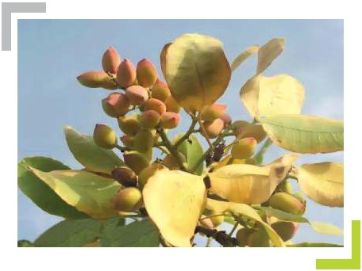

#### فسفر  (ماکرو) 

P

###### علائم کمبود در برگ‌ها

علائم کمبود فسفر به‌ندرت در پسته دیده می‌شود؛

در کمبود شدید: ارغوانی‌شدن برگ‌های انتهایی و ریزش تدریجی آن‌ها، باریک‌شدن ساقه‌ها و افزایش فاصله میان‌گره‌ها، و سبز کم‌رنگ ماندن برگ‌های جوان

###### روش‌های مدیریت و اصلاح کمبود	

افزودن کودهای فسفاته (سوپر فسفات ساده یا تریپل) به خاک به‌صورت چالکود (معمولاً در زمستان)​

تنظیم pH خاک در محدوده ۶ تا ۷ برای افزایش فراهمی فسفر

در خاک‌های آهکی، محلول‌پاشی فسفر در زمان پر شدن مغز (مثلاً محلول مونو‌آمونیوم فسفات یا اسید فسفریک در اواسط تابستان) توصیه می‌شود تا کمبود فسفر جبران و از ریزش جوانه‌های گل سال بعد جلوگیری گردد

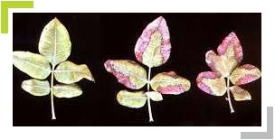

#### پتاسیم  (ماکرو) 

K

###### علائم کمبود در برگ‌ها

کم‌رنگ شدن برگ‌ها و نکروزه شدن (قهوه‌ای شدن) حاشیه برگ‌های مسن​

لبه برگ‌ها به سمت بالا پیچیده می‌شود؛ علائم ابتدا در برگ‌های پیر ظاهر می‌گردد. در کمبود شدید، ممکن است سوختگی نامنظم و آفتاب‌سوختگی در پهنک برگ یا میوه دیده شود

###### روش‌های مدیریت و اصلاح کمبود	

اضافه کردن کود سولفات پتاسیم به خاک برای رفع کمبود (حدود ۱–۲ کیلوگرم به‌ازای هر درخت به‌صورت چالکود همراه با کود دامی در زمستان)​

از مصرف کلرید پتاسیم در خاک‌های شور یا دارای کلسیم/منیزیم بالا خودداری شود (زیرا یون کلر و سایر کاتیون‌ها جذب پتاس را مختل می‌کنند)

محلول‌پاشی نیترات پتاسیم (محلول ۱٪) در شروع پر شدن مغز نیز جهت بهبود خندانی میوه و کیفیت مغز پسته توصیه شده است

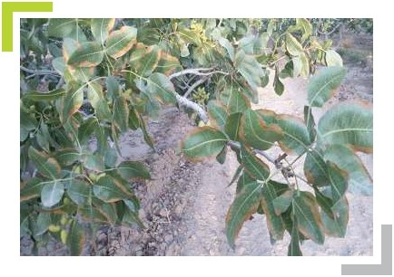

#### کلسیم (ماکرو) 

Ca

###### علائم کمبود در برگ‌ها

چروکیده و کج شدن برگ‌های جوان نزدیک انتهای شاخه (برگ‌ها حالت قاشقی یا لوله‌شده به سمت بالا/پایین پیدا می‌کنند)​

ظاهر شدن لکه‌های روشن و شفاف در نوک و حاشیه برخی برگ‌ها؛ در میوه پسته کمبود Ca موجب عارضه لکه استخوانی روی پوست سخت می‌شود (نقاط سیاه و بدشکلی روی پوست سخت دانه)

###### روش‌های مدیریت و اصلاح کمبود	

محلول‌پاشی ترکیبات کلسیم‌دار روی شاخ‌وبرگ درخت (مثلاً محلول کلرید کلسیم ۱–۳٪ معادل ۱۰–۳۰ کیلوگرم در هزار لیتر آب) در طول فصل رشد برای تأمین کلسیم برگ‌ها و بهبود کیفیت میوه توصیه می‌شود​

در خاک، می‌توان از گچ کشاورزی (سولفات کلسیم) جهت اصلاح خاک‌های سدیمی و افزایش کلسیم قابل جذب بهره گرفت (اگرچه در بیشتر باغ‌های پسته خاک به طور طبیعی کلسیم کافی دارد).

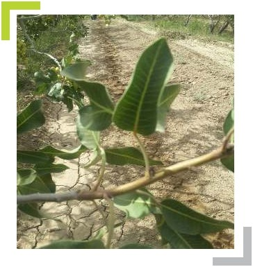

#### منیزیم  (ماکرو) 

Mg

###### علائم کمبود در برگ‌ها

کاهش کلروفیل و فتوسنتز؛ زردی بین‌رگبرگی در برگ‌های مسن (کلروز پهنک برگ با حاشیه سبز باقی‌مانده) که به‌تدریج گسترش می‌یابد

در اثر کمبود Mg رشد درخت کند شده و برگ‌های پیر کوچک می‌مانند؛ در برخی موارد لکه‌های ارغوانی/قرمز نیز روی برگ پیر ظاهر می‌شود

###### روش‌های مدیریت و اصلاح کمبود	

محلول‌پاشی سولفات منیزیم (مثلاً محلول ۵ در هزار) طی چند نوبت در فصل رشد برای رفع کلروز منیزیم مفید است

معمولاً ۲ تا ۵ مرتبه محلول‌پاشی از اوایل خرداد با فاصله‌های دوهفته‌ای توصیه می‌شود تا علائم کمبود برطرف گردد

همچنین می‌توان در زمستان مقداری سولفات منیزیم یا دولومیت را به صورت چالکود به خاک اضافه کرد تا منیزیم خاک تأمین شود

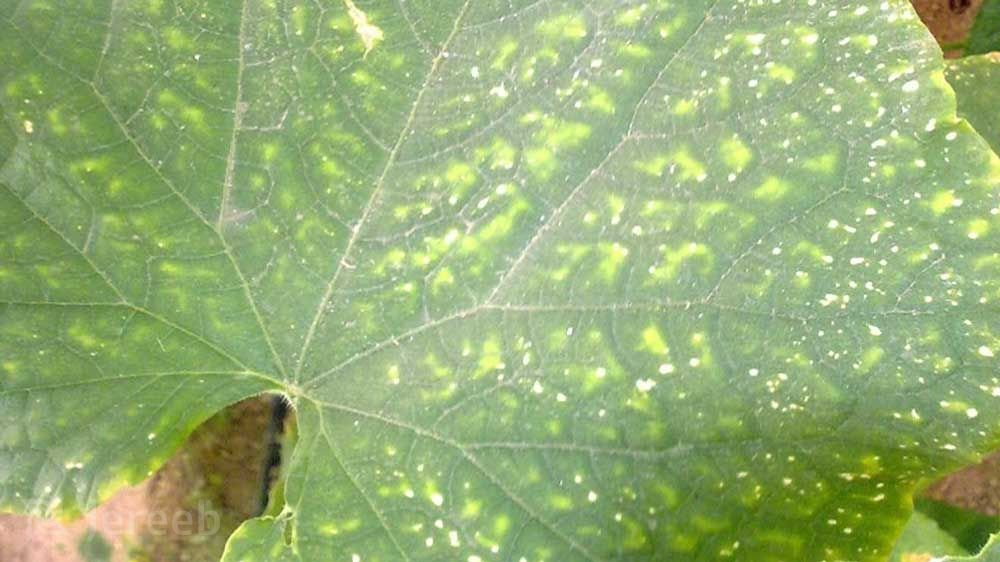

#### گوگرد (ماکرو) 

S

###### علائم کمبود در برگ‌ها

زردی عمومی برگ‌های جوان و بخش‌های انتهایی (کلروز شبیه کمبود نیتروژن)​؛ کاهش رشد شاخه‌ها و نازک شدن ساقه‌ها؛ گاهی پیچیدگی و بدشکلی برگ‌های تازه‌رَس. کمبود گوگرد اغلب با زرد شدن برگ‌های جوان نمایان می‌شود و در ادامه موجب توقف رشد و لطیف و نازک شدن برگ‌ها می‌گردد.

###### روش‌های مدیریت و اصلاح کمبود	

افزودن کودهای حاوی گوگرد به خاک: از جمله سولفات آمونیوم، گوگرد عنصری (گل گوگرد) یا گچ کشاورزی (سولفات کلسیم) برای افزایش گوگرد قابل جذب خاک توصیه می‌شود​. در صورت بالا بودن pH خاک، آبیاری با آب کمی اسیدی (مثلاً حاوی اسید سولفوریک) می‌تواند جذب گوگرد و ریزمغذی‌ها را بهبود بخشد. همچنین استفاده از کودهای آلی حاوی گوگرد (مانند کودهای دامی) در برنامه غذایی باغ مفید است.

*از طریق عکس غیر قابل تشخیص است*

#### آهن (میکرو) 

Fe

###### علائم کمبود در برگ‌ها

رنگ‌پریدگی (زرد شدن) بین‌رگبرگی برگ‌های جوان؛ ابتدا فاصله بین رگبرگ‌ها زرد می‌شود در حالی که خود رگبرگ‌ها سبز باقی می‌مانند​. با شدت گرفتن کمبود، تمام سطح برگ‌های تازه‌رَس زرد یا تقریباً سفید شده و حاشیه آن‌ها ممکن است سوختگی پیدا کند. رشد سرشاخه‌های دچار کمبود آهن ضعیف می‌ماند و در موارد شدید تعداد و اندازه دانه‌های درخت کاهش می‌یابد​.

###### روش‌های مدیریت و اصلاح کمبود	

در باغ‌های پسته با خاک آهکی، کلات آهن (EDDHA) به‌صورت خاکی نزدیک ریشه در اواخر زمستان یا بهار استفاده می‌شود​. برای رفع سریع‌تر زردی برگ‌ها نیز محلول‌پاشی سولفات آهن یا کلات آهن روی شاخ‌وبرگ درخت در یکی دو نوبت (اواخر بهار و اوایل تابستان) انجام می‌گیرد​. توجه شود در خاک‌های قلیایی، استفاده از کلات پایدار (مثل Fe-EDDHA) موثرتر از سولفات آهن است و از مصرف بیش از حد آهن نیز باید پرهیز شود (زیرا مسمومیت آهن موجب لکه‌های قهوه‌ای روی برگ می‌شود).

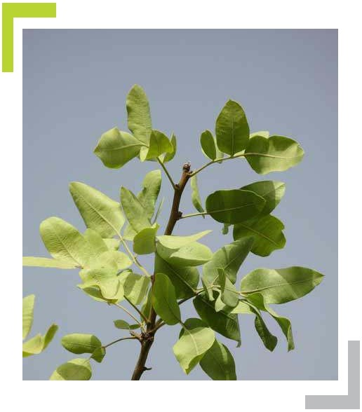

#### روی (میکرو) 

Zn

###### علائم کمبود در برگ‌ها

تاخیر در باز شدن جوانه‌های رویشی و زایشی (حتی تا یک ماه)؛ پس از باز شدن، برگ‌های انتهایی کوچک، کم‌رنگ و گاهی نکروزه شده و به صورت دسته‌های جارویی (رزت) در می‌آیند​. در کمبود شدید، سرشاخه‌های جوان خشک می‌شوند؛ میوه‌های پسته روی درخت آشکارا کوچک‌تر و قرمزتر از میوه‌های سالم بوده و تعداد دانه در خوشه کاهش می‌یابد (اغلب دانه‌ها پوک می‌شوند)​.

###### روش‌های مدیریت و اصلاح کمبود	

محلول‌پاشی سولفات روی روی شاخ‌وبرگ در اواخر زمستان (زمان تورم جوانه‌ها) یا اوایل بهار، رایج‌ترین روش رفع کمبود روی در پسته است​. معمولاً محلول سولفات روی ۰٫۵٪ (5 در هزار) یک تا دو نوبت اسپری می‌شود. همچنین می‌توان در زمستان مقداری سولفات روی همراه مواد آلی در چالکود استفاده کرد یا در خاک‌های خیلی آهکی از کلات روی بهره گرفت​. (محلول‌پاشی پس از برداشت نیز می‌تواند به بهبود روی سال بعد کمک کند.)

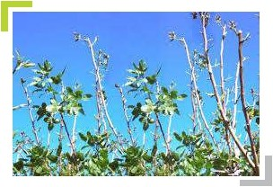

#### مس (میکرو) 

Cu

###### علائم کمبود در برگ‌ها

علائم کمبود مس معمولاً از اواسط تابستان ظاهر می‌شود: سوختگی برگ‌های جوان نزدیک انتهای شاخه (نوک برگ‌های تازه‌روییده حالت سوخته و خشک پیدا می‌کنند)​؛ در کمبود شدید همان شاخه‌ها دچار سرخشکیدگی می‌شوند و برگ‌های آسیب‌دیده می‌ریزند. برگ‌های نارس نوک‌سوخته گاهی شکل قلبی پیدا می‌کنند و شاخه‌های بالایی خمیده و حالت عصایی به خود می‌گیرند​. مغز پسته در میوه‌های روی درخت کمبود مس دچار بدشکلی و کاهش کیفیت می‌شود.

###### روش‌های مدیریت و اصلاح کمبود	

محلول‌پاشی یا خاک‌دهی سولفات مس (کات کبود) روش رایج تأمین مس است​. معمولاً در زمستان مقداری سولفات مس را در چالکود همراه کود دامی قرار می‌دهند و در صورت مشاهده علائم کمبود در تابستان، محلول‌پاشی ۳ تا ۵ در هزار سولفات مس (یا استفاده از محلول بردو/اکسی‌کلرید مس) انجام می‌شود. این محلول‌پاشی علاوه بر تأمین مس، به کاهش بیماری‌های قارچی نیز کمک می‌کند.

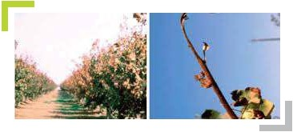

#### منگنز (میکرو) 

Mn

###### علائم کمبود در برگ‌ها

زردی (کلروز) بین‌رگبرگی در برگ‌های جوان شبیه کمبود آهن، با این تفاوت که بخشی از حاشیه برگ سبز باقی می‌ماند​. رگبرگ‌های اصلی گاهی حالت قرمز یا ارغوانی پیدا می‌کنند و برگ‌های جوان کوچک و بدشکل می‌رویند (ریزبرگی)​. علائم ابتدا در بافت‌های جوان دیده می‌شود چون منگنز در گیاه تحرک کمی دارد. در موارد کمبود شدید، ممکن است لکه‌های نکروزه نیز در پهنک برگ ظاهر شود و برگ‌ها زود بریزند.

###### روش‌های مدیریت و اصلاح کمبود	

محلول‌پاشی سولفات منگنز (مثلاً ۳ در هزار) روی برگ‌ها در بهار تا اوایل تابستان برای رفع کمبود توصیه می‌شود​. در خاک‌های با pH بسیار بالا یا خاک‌های آلی (مواد‌آلی زیاد) می‌توان سولفات منگنز را به صورت خاکی (چالکود در پای درخت) نیز به کار برد​. همچنین استفاده از کودهای کامل ریزمغذی حاوی منگنز در برنامه تغذیه‌ای (مثلاً در زمان تورم جوانه‌ها) موثر است.

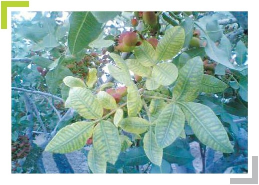

#### بور (میکرو) 

B

###### علائم کمبود در برگ‌ها

کمبود بور در برخی باغ‌های پسته (با آب و خاک کم‌بُر) مشاهده می‌شود. علائم شامل: بدشکلی برگ‌های جوان (مرگ بافت نوک برگ و پیچیدگی و شکنندگی برگ‌های تازه)​؛ رشد نکردن جوانه‌های انتهایی و خشک‌شدن سرشاخه‌های جدید؛ زرد شدن و ریزش برگ‌های نارس قبل از بلوغ کامل؛ کاهش تشکیل میوه و پوکی دانه‌ها (به‌دلیل اختلال در گرده‌افشانی و لقاح)​. در مقابل، در برخی مناطق پسته‌خیز بور اضافی نیز دیده می‌شود که باعث سوختگی نوک و حاشیه برگ‌ها (مسمومیت بور) می‌گردد​.

###### روش‌های مدیریت و اصلاح کمبود	

محلول‌پاشی اسید بوریک یا بوراکس به مقدار کم (مثلاً ۰٫۵ در هزار) روی شاخ‌وبرگ در اواخر زمستان (زمان تورم جوانه‌ها) برای تامین بور توصیه می‌شود​. یک نوبت محلول‌پاشی بور پس از برداشت محصول نیز مفید است تا ذخایر بور برای سال بعد کافی باشد​. توجه شود که مصرف بیش از حد بور خطر مسمومیت دارد؛ لذا حتماً بر اساس آزمون خاک/برگ و به مقدار محدود استفاده گردد.

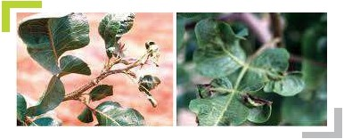

#### مولیبدن (میکرو) 

Mo

###### علائم کمبود در برگ‌ها

علائم کمبود مولیبدن در پسته نادر است. مولیبدن در تشکیل آنزیم نیترات‌ردوکتاز نقش دارد و کمبود آن باعث اختلال در تغذیه نیتروژنی می‌شود​. در نتیجه، علائم کمبود Mo عمدتاً به صورت کمبود نیتروژن بروز می‌کند: رنگ‌پریدگی عمومی گیاه، کوتاه ماندن شاخه‌ها، زردی و سوختگی حاشیه برگ‌های مسن و کاهش رشد​. (تشخیص کمبود Mo باید با آزمایش برگ تأیید شود، چون مشابه کمبود ازت است.)

###### روش‌های مدیریت و اصلاح کمبود	

برای رفع کمبود مولیبدن از مقادیر بسیار کم کودهای حاوی Mo استفاده می‌شود. معمولاً افزودن آهک به خاک توصیه می‌گردد تا حلالیت مولیبدن افزایش یابد​. می‌توان از محلول‌پاشی یا خاک‌دهی مولیبدات سدیم (در حد چند گرم ماده موثره به ازای هر درخت) استفاده کرد​. این عنصر اغلب در کودهای کامل ریزمغذی یا فروت‌ست‌ها به میزان جزئی وجود دارد و کمبود آن با همین مقادیر اندک برطرف می‌شود.

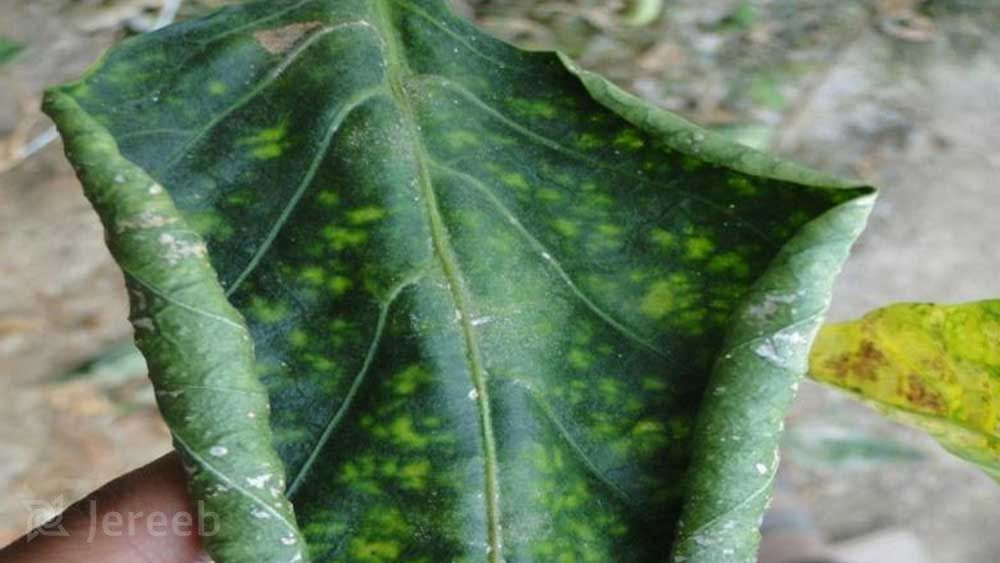